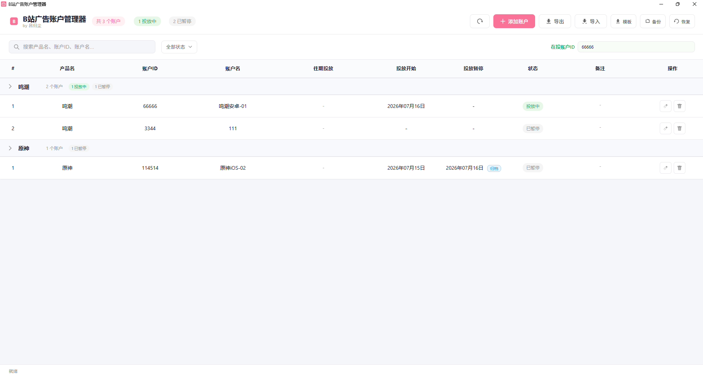

# BAAM · B站广告账户管理器

**Bilibili Ad Account Manager (BAAM)** —— 一款轻量、纯本地的桌面应用，帮助你便捷地管理 B 站广告账户的投放信息。

> 数据 100% 存储在本地 SQLite 数据库，不联网、不上传，隐私安全。




---

## ✨ 功能特性

### 账户管理
- 账户增删改查（产品名、账户 ID、账户名、投放开始/暂停、备注、往期投放）
- **按产品自动分组**，同一产品下的账户折叠展示；无投放中账户的产品组自动折叠
- 智能状态计算：投放中 / 已暂停（暂停日 = 今天即视为已暂停）
- 投放中账户越多的产品组排序越靠前

### 数据存储与安全
- **SQLite 本地数据库**为主存储，ACID 事务，数据不丢
- **Excel 实时副本**：每次操作自动同步 `accounts_backup.xlsx`
- **快照备份**：手动一键备份 + 每小时自动备份，最多保留 10 份
- **一键恢复**：从任意备份文件还原数据

### 高效录入
- 自定义美观日历选择器（支持年月快速切换、周末高亮）
- 首页**内联编辑**：直接点击日期 / 备注单元格即可修改
- 产品名下拉建议、批量导入（Excel 模板 / JSON）
- 智能日期识别：`260701`、`20260701`、`2026-07-01`、`2026/07/01` 自动归一化
- 往期投放支持换行 / 分号分隔；`260709-` 格式自动识别为"仍在投放"

### 便捷操作
- **一键复制**：点击产品名 / 账户 ID / 账户名单元格即可复制
- **在投账户 ID 汇总框**：自动聚合所有投放中账户 ID（逗号分隔），点击全部复制
- **归档**：一键把当前投放时段归档到往期投放
- 表头冻结、搜索过滤、状态筛选

---

## 🚀 快速开始

### 环境要求
- Windows 10 / 11（自带 Edge WebView2 运行时）
- Python 3.8 及以上

### 安装依赖
```bash
pip install -r requirements.txt
```

### 启动
- **双击 `启动.vbs`** —— 无命令行窗口，直接打开应用（推荐）
- 或双击 `启动.bat` —— 带日志输出，便于排查问题
- 或命令行运行：
```bash
python run.py
```

首次启动会自动创建 `accounts.db` 数据库和 `导入模板.xlsx` 模板文件。

---

## 📁 项目结构

```
BAAM/
├── index.html          # 主界面
├── styles.css          # 样式
├── renderer.js         # 前端逻辑
├── run.py              # Python 后端（SQLite + HTTP API + WebView 窗口）
├── requirements.txt    # Python 依赖
├── baamlogo.png        # 应用图标
├── 启动.vbs            # 静默启动（无命令行）
├── 启动.bat            # 带日志启动
├── main.js             # Electron 主进程（备用方案）
├── preload.js          # Electron preload（备用）
└── package.json        # Node 配置（备用）
```

运行时自动生成（已在 `.gitignore` 中排除）：
- `accounts.db` —— SQLite 数据库
- `accounts_backup.xlsx` —— Excel 实时副本
- `导入模板.xlsx` —— 导入模板
- `backups/` —— 快照备份目录

---

## 🛠 技术栈

- **前端**：原生 HTML / CSS / JavaScript
- **后端**：Python + [pywebview](https://pywebview.flowrl.com/)（系统原生 WebView2 渲染）
- **数据库**：SQLite
- **Excel**：openpyxl

---

## 📄 License

MIT License
